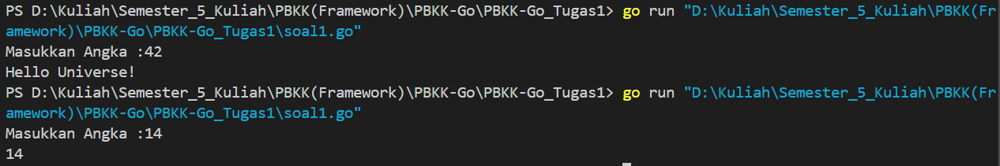

# Tugas_PBKK_GO-1
## Soal 1
### Hello Universe!
Buatlah kode dengan bahasa pemrograman Golang. Program ini menerima input berupa angka. Jika memberikan input angka 42, maka program akan memberikan output Hello Universe!. Jika angka selain 42, program akan memberikan output angka yang diinputkan.

### Contoh Input Output

## Soal 2
### Reverse Words
Buatlah kode dengan bahasa pemrograman Golang. Program ini menerima input berupa kalimat dengan minimal 3 kata. Setiap kata dalam kalimat akan dibalik secara individual tanpa mengubah urutan kata. Jika kalimat yang dimasukkan memiliki kurang dari 3 kata, program akan memberikan pesan error.

### Contoh Input Output
![alt text]
